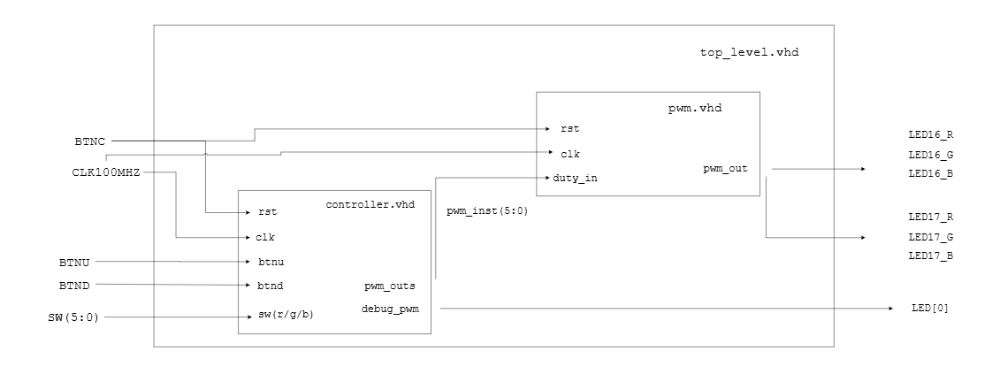
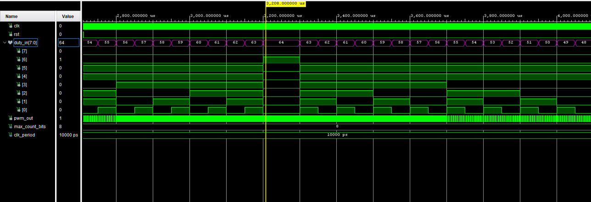

# Topic 3 - PWM for LED brightness control  

## Členovia tímu
\
Samuel Fabíni zodpovedný za programovanie

Dominik Hejda zodpovedný za pogramovanie

Matej Galajda zodpovedný za readME file a pomoc pri programovaní

Sára Wozárová zodpovedná za pomoc pri programovaní, pomoc pri vytváraní readME file a vytvorenie TOP LEVEL schémy 

## Teoretický úvod a Princip PWM modulace

Náš tím navrhol a vytvoril program v jazyku VHDL. Tento program má za úlohu úpravu jasu RGB LED diod na doske Nexys-A7 50T. Toto upravovanie jasu bude prediehať na princípe PWM (Pulse Width Modulation). PWM je spôsob riadenia výkonu pomocou rýchleho zapínania a vypínania signálu. Výsledný priemerný výkon sa mení podľa šírky impulzu (tzv. duty cycle), čo znamená, že čím dlhšie je signál v stave „zapnuté“, tým väčší výkon sa prenáša – teda impulz je širší. Ďalej sú na doske využité tlačidlá na ovplyvnovanie programu. Uživatel bude vedieť ovplyvniť maximálnu velkosť jasu a farbu, keďže LED diody fungujú na RGB princípe (tri malé svetlá -red-green-blue- ktoré robia biele svetlo). 

## Popis hardwaru a vysvetliene demo verzie 

Program je implementovaný na doske Nexys-A7 50T, vytvorený firmou Digilent. Doska obsahuje mnohé komponenty, z ktorých boli niektoré využité pre náš projekt. 

\
<ins>Použité komponenty a ich využitie </ins>\
\
LED16 a LED17 = RGB LED diody riadené výstupným PWM signálom\
\
BTNC (button central) = tlačidlo na resetovanie programu\
\
BTNU a BTND (button up, down) = tlačidlá na zvyšovanie a znižovanie jasu o 10%\
\
SW[13-15] = ovládanie farby LED17\
\
SW[0-2] = ovládanie farby LED16

## Popis softwaru a Top level
Tento projekt implementuje riadenie jasu LED diód pomocou modulácie šírky impulzu (PWM) vo VHDL. Projekt sa skladá z troch hlavných modulov: *pwm*, *controller* a *top_level*. Modul *pwm* generuje PWM signál na základe vstupného signálu *duty_in*. Interný čítač sa pri každom hodinovom impulze inkrementuje; ak je jeho hodnota menšia ako *duty_in*, výstup *pwm_out* je v logickej úrovni `'1'`, inak `'0'`. Po dosiahnutí maximálnej hodnoty sa čítač vynuluje. Modul *controller* riadi hodnotu *duty*, ktorá sa priamo pripája na vstup *duty_in* modulu *pwm*. Hodnota *duty* sa dynamicky zvyšuje alebo znižuje na základe nastaveného smeru zmeny. Keď *duty* dosiahne maximum, smer sa obráti a začína sa znižovať; keď *duty* klesne na nulu, smer sa zmení opäť a hodnota sa začne zvyšovať. V module *controller* je implementovaný aj predelič frekvencie (*prescaler*), ktorý spomaľuje zmeny jasu, aby boli prechody plynulé. Pomocou tlačidiel *btnu* a *btnd* je možné meniť maximálnu hodnotu jasu (*max_duty*). Modul *top_level* prepája *controller* a *pwm*, a zabezpečuje pripojenie výstupných PWM signálov na jednotlivé farby LED diód. Výsledkom je plynulé zosvetľovanie a stmavovanie LED svetiel, čím sa dosahuje efekt "dýchania" svetla.

[Video fungovania programu na doske](https://youtu.be/AufJf0AtXnM)

### Schema top levelu

### Simulacia komponentov 
\
\
\
Simulace pwm.vhdl súboru -> na obrázku môžeme vydieť ako funguje pwm signál, postupné rozširovanie, dosiahnutie maxima v 64 a následné zužovanie.

### Reference
- [Teória PWM - Wikipedia](https://en.wikipedia.org/wiki/Pulse-width_modulation)
- [Fungovanie a písanie kódu PWM](https://vhdlwhiz.com/pwm-controller/)
- [Fungovanie a písanie kódu v md (syntax) pre readyME](https://docs.github.com/en/get-started/writing-on-github/getting-started-with-writing-and-formatting-on-github/basic-writing-and-formatting-syntax)
- [Generovanie TB súboru](https://vhdl.lapinoo.net/)
- [Ai na kontrolu kódu](https://chatgpt.com/)
- [Constrainový súbor](https://raw.githubusercontent.com/Digilent/digilent-xdc/master/Nexys-A7-50T-Master.xdc)

